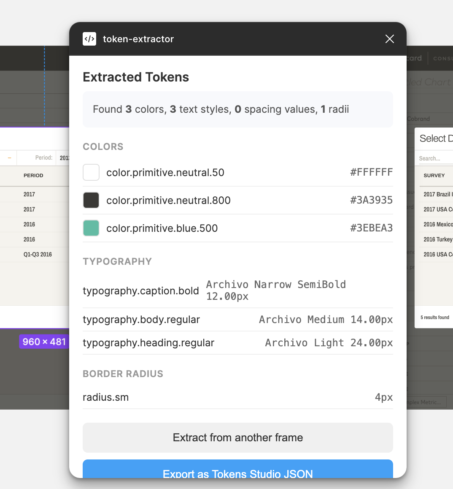

# Token Extractor

A Figma plugin that extracts design tokens from selected frames and outputs [Tokens Studio](https://tokens.studio/)-compatible JSON, with automatic 3-tier naming conventions.



---

## Why this exists

When inheriting a product without a published component library, reconstructing the implicit design system is tedious and error-prone. This plugin automates the extraction step — select any frame, run the plugin, and get a structured token file you can import directly into Tokens Studio.

The longer-term goal is to extract from multiple frames across multiple files and incrementally build a design system by comparing and reconciling tokens across extractions.

---

## What it extracts

- **Colours** — solid fills, classified by hue family and lightness shade
- **Typography** — font family, weight, and size, mapped to a display/heading/body/caption scale
- **Spacing** — auto layout item spacing, mapped to an xs–2xl scale
- **Border radius** — corner radius values, mapped to sm/md/lg/full

---

## Token naming

Tokens are named using a 3-tier primitive convention:

| Type | Example output |
|------|---------------|
| Colour | `color.primitive.green.600` |
| Typography | `typography.body.bold` |
| Spacing | `spacing.md` |
| Radius | `radius.sm` |

Naming is currently rules-based (HSL analysis for colours, size scales for typography and spacing). An optional Anthropic API layer for semantic naming is planned.

---

## Output format

Tokens are exported as [Tokens Studio](https://tokens.studio/) compatible JSON, wrapped in a `global` set:

```json
{
  "global": {
    "color.primitive.green.600": {
      "value": "#00915A",
      "type": "color"
    },
    "spacing.md": {
      "value": "16",
      "type": "spacing"
    }
  }
}
```

---

## Installation

> Requires the [Figma desktop app](https://www.figma.com/downloads/) and Node.js.

1. Clone this repository
2. Install dependencies:
   ```
   npm install
   ```
3. Build the plugin:
   ```
   npm run build
   ```
4. In Figma desktop, go to **Plugins → Development → Import plugin from manifest**
5. Select the `manifest.json` file from this folder

---

## Usage

1. Select a frame in Figma
2. Run the plugin via **Plugins → Development → token-extractor**
3. Click **Extract from selected frame**
4. Review the extracted tokens
5. Click **Export as Tokens Studio JSON** to download `tokens.json`
6. Import into Tokens Studio via **Settings → Load from file/folder**

---

## Roadmap

- [ ] Check `node.boundVariables` before extracting raw values -- use existing token names where present
- [ ] Fix gray misclassification (raise saturation threshold for neutral detection)
- [ ] Improve duplicate token handling -- flag conflicts instead of auto-numbering
- [ ] Multi-frame comparison and reconciliation flow
- [ ] Persistent token store across extractions within a session
- [ ] Optional Anthropic API layer for semantic naming suggestions
- [ ] Tier 2 token generation (primitive → semantic mapping)

---

## Tech

- Figma Plugin API
- TypeScript
- Tokens Studio JSON format

---

## Author

[Tiffany O'Keeffe](https://tiffanyokeeffe.com) — Senior Product Designer specialising in design systems and fintech.
